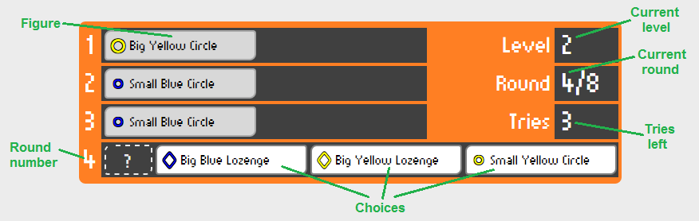

# ELUS

At first glance, **ELUS** looks like a simple logic game of pattern recognition... but it has a twist: you need to figure out the pattern while you are playing the game!

## How to play ELUS

### Main menu

Use the buttons on the top of the screen to navigate before starting a game.

   * **New game: Classic** - Starts a new *Classic* game. To change the game type, open the game type options with the arrow to the right of the button and select the type you want to play. The **New game** button then will start the game of the selected type.
   * **Instructions** - Shows on-screen instructions for playing the game.
   * **About** - Shows some info about the author of the game.
   * **GitHub** - Takes you to the project's codebase on GitHub (opens a new tab).

### Game mechanics

When you start a game, three **figures** are automatically laid out for you.

A figure has three **attributes**, and each attribute can take one of two values:
   * **Size** - *Big* or *Small*,
   * **Color** - *Blue* or *Yellow*,
   * **Shape** - *Circle* or *Lozenge*.

For example, this is a  and this is a .

There is a hidden **rule** that applies to the entire game round, and which determines which figure comes next. The rule is *based on a single attribute of the last figure* and defines the *required attribute of the next figure.*
         
For example, the rule can be this:
> *If the last figure's color is Blue, then choose the figure with Circle shape, but if the last figure's color is Yellow, then choose the figure with Lozenge shape instead.*

In this case - with regards to the selection - the last figure's size and shape do not matter, only the color (*Blue* or *Yellow*). Similarly the chosen figure's size and color do not matter.

So the first three figures are there and you need to select the next one. There are **three choices, but only one is correct**, the others do not follow the rule.

*Click on the figure you think comes next in sequence according to the rule.* Your choice gets added to the sequence and the game advances to the next round. **Whether or not your choice was correct, it becomes the "new last figure", and the rule will apply - the choices in the next round will be based on that figure.**

Repeat this for the *five next figures* without making more than *three errors* (selecting an incorrect figure). If you manage to do so, you can go to the next level and challenge a more difficult rule.

### Rules

In a *Classic* game there are **three levels**, with an increasingly difficult rule. You can hover over the "?" placeholder of the next figure to get a hint about the rule.

> **Level 1**: Always choose figure with **same** *ATTRIBUTE X* or with **different** *ATTRIBUTE X* as the last figure.

Example: Always choose figure with a different size than the last one.

> **Level 2**: ...

TBD

> **Level 3**: ...

TBD

### Game screen

TBD

### Example

TBD

## About

ELUS is a neat logic puzzle game I first saw in the *Space Rangers 2: Rise of the Dominators* video game (it was one of the side missions). I liked its concept and decided to replicate it as a standalone game just to practice my coding skills. I am not the original author of the idea or the rules.

The game was written in pure JavaScript utilizing some popular frameworks like Bootstrap and JQuery. I also used QUnit for unit testing. Note that I come from a server side world so some solutions might not be the most "HTML5-y" way of doing things...

If you want to send any comments, ideas or contribute the project, you are welcome to do so.

Adam Demjen (demjened@gmail.com), 2015
