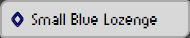
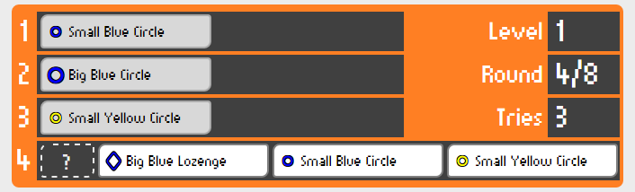

# ELUS

Welcome to **ELUS**!

At first glance, ELUS looks like a simple logic game of pattern recognition... but it has a twist: you need to figure out the pattern while you are playing the game!

[Play ELUS](http://demjened.github.io/elus/)

## How to play ELUS

### Main menu

Use the buttons on the top of the screen to navigate around before starting a game.

   * **New game: Classic** - Starts a new *Classic* game. To change the game type, open the game type options with the arrow to the right of the button and select the type you want to play. The **New game** button will then start the game of the selected type.
   * **Instructions** - Shows on-screen instructions for playing the game.
   * **About** - Shows some info about the author of the game.
   * **GitHub** - Takes you to the project's codebase on GitHub.

### Game mechanics

The goal of ELUS is to complete a sequence of **figures** by correctly choosing the one that comes next.

A figure has three **attributes**, and each attribute can take one of two values:
   * **Size** - *Big* or *Small*,
   * **Color** - *Blue* or *Yellow*,
   * **Shape** - *Circle* or *Lozenge*.

For example, this is a  and this is a .

---

There is a hidden **rule** that applies to the entire game round, and which determines which figure comes next in the sequence. The rule is **based on a single attribute of the last figure** and defines the **required attribute of the next figure**.

In a *Classic* game there are **three levels**, each with an increasingly difficult rule:

> **Level 1**: Always choose figure with **same** *ATTRIBUTE X* or with **different** *ATTRIBUTE X* as the last figure.

Example: *Always choose figure with a different size than the last one.*

> **Level 2**: If the last figure has **this** of *ATTRIBUTE X*, then choose figure with **this** of *ATTRIBUTE Y*, otherwise choose figure with **that** of *ATTRIBUTE Y*.

Example: *If the last figure is a Circle, choose a Small figure, otherwise choose a Big figure.*

> **Level 3**: If the last figure has **this** of *ATTRIBUTE X*, then choose figure with **this** of *ATTRIBUTE Y*, otherwise choose figure with **that** of *ATTRIBUTE Z* or with **same** *ATTRIBUTE Z* or with **different** *ATTRIBUTE Z* as the last figure.

Example: *If the last figure is Big, choose a Lozenge figure, otherwise choose a Blue figure.*

You can hover over the **[ ? ]** placeholder next to the choices to get a hint about the current rule.

In a *Random* game there is only **one level**, and the rule is randomly generated... it can be anything!

---

When you start a game, the first three figures are laid out for you according to the rule. You need to select the next figure from **three choices, of which only one is correct**, the others do not follow the rule.

**Click on the figure you think comes next in sequence according to the rule.** Your choice gets added to the sequence and the game advances to the next round. **Whether or not your choice was correct, it becomes the "new last figure", and the rule will apply - the choices in the next round will be based on that last figure.**

Repeat this for the *five next figures* without making *three errors* (selecting an incorrect figure). If you manage to do so, you can go to the next level and challenge a more difficult rule.

### Tutorial

This quick tutorial shows you how to think when playing ELUS.

Consider the following starting screen (Level 1 rule):

We know the Level 1 rule is like this:

> Always choose figure with **same** *ATTRIBUTE X* or with **different** *ATTRIBUTE X* as the last figure.

Which attribute remains the same or alternates on the first three figures?
   * **Size** - *Small* -> *Big* -> *Small*: always different
   * **Color** - *Blue* -> *Blue* -> *Yellow*: no pattern
   * **Shape** - *Circle* -> *Circle* -> *Circle*: always the same

Seems like there are two possible rules: *Always choose figure with different size as the last figure* or *Always choose figure with same shape as the last figure*.

Let's look at the choices. There are two figures with Circle shape: **Small Blue Circle** and **Small Yellow Circle**. Given that there's always **only one choice that is correct**, the rule cannot be *Always choose figure with same shape as the last figure*, because it would not be straightforward which Circle to choose. Therefore the rule must be *Always choose figure with different size as the last figure*. So let's select **Big Blue Lozenge**.

Yay, our assumption was correct! And we know the rule, so it's going to be trivial to select the next four figures and win the level.

*Now it's your turn! But don't get too comfortable, Levels 2 and 3 are not going to be this simple...*
   
## About

ELUS is a neat logic puzzle game I first saw in the *Space Rangers 2* video game (it was one of the side missions). Being a logic game enthusiast I liked its concept and decided to reengineer it as a standalone game, just for fun and to practice my coding skills. So I am not the original author of the idea or the rules.

The game was written in pure JavaScript utilizing some popular frameworks like Bootstrap and JQuery. I also used QUnit for unit testing. Note that I come from a server side world so some solutions might not be the most "HTML5-y" way of doing things...

If you want to send any comments, ideas or contribute the project, you are welcome to do so.

Adam Demjen (demjened@gmail.com), 2015
